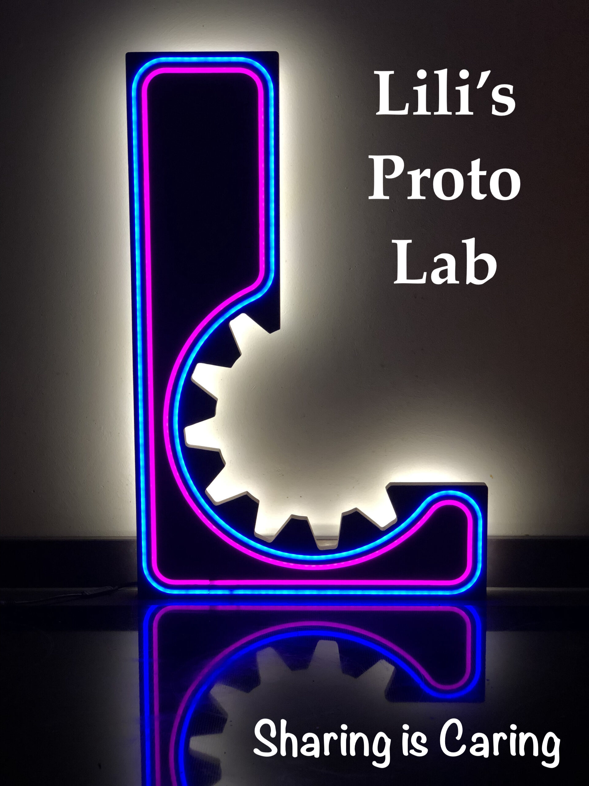

# Open Hardware Documentation Challenge

This repository presents a small hardware project for the course Open Science for Physicists (NS-PH500M) at Utrecht University. The goal of this repository is to be a starting place for all students to find the basic documentation which they can then use the template to build up. Update it regularly and as you make choices to make it useful for the next set of students who will have to recreate your project (hopefully with better documentation). 

[How to use Markdown, GitHubs formatting language](https://docs.github.com/en/get-started/writing-on-github/getting-started-with-writing-and-formatting-on-github/quickstart-for-writing-on-github)

## Main features
_The original project is based on work from Zach Meredith who used a gear box to convert a quickly spinning motor into a more slowly spinning display plate in our Leapfrog Bolt 3D printer_ 

Each subfolder contains a `_readme.md` file that explains the conventions and purpose of that folder for the (future) collaborators to keep it tidy.

In the results section you can see the end product of his gearing system using an open box version of the gear box. This allows the different components to be viewed. 

In documents you can find the STL files to be printed as well as the fusion files which would allow you to tinker with the gear ratios. 

In hardware you can find an overview of the necessary steps to produce the parts and assemble the gearbox. 

This template is adjusted to the typical needs of a hardware project made for research or education. 

The purpose of each subfolder is explained below:
+ [Hardware](Hardware/_readme.md): Contains all the information related to the hardware construction part of the prototype. Build instructions, (binary) design files and components. Use subfolders for more complex assemblies.
+ [Documents](Documents/_readme.md): Contains all general documents surrounding the project: images, background information, literature sources, hazard documents.
+ [Results](Results/_readme.md): Show your prototype in action, if possible including experimental results.
+ [Software](Software/_readme.md): For hardware projects that have an operating software or firmware.

## Build instructions
_Guide the reader with the order of browsing your project repository for an optimum building experience_
  

## Outcomes
_Here you can list the outcomes of the project that you would like to hightlight. It does not need to be an exhaustive list_

We will list some best practices and good examples from projects that have used this template for their documentation.

## Team
_Even though platforms such as github show a list of user accounts for contributors for a project or repository, the past contributors or external collaborators also deserve a place here_

+ Project initiators: Edward Paddon and Alexis Gilbert
+ Contributors: 
	Zach Meredith,
	Pieter Kooijman

## Get involved
_Especially for open source projects, it is beneficial to motivate potential users of the project to contribute back or share their feedback. Make it easy for them._

Comments and suggestions on this folder structure are always welcome. Please create an issue to share your feedback or question, or if you prefer send a pull request. 

Better structured projects can explain a number of options for contributors such as: 
+ (where to start)
+ (issue template)
+ (direct contact)
+ (pull requests)

## License
_After the README, A LICENSE is the most important file in the project documentation. Without a license, there is too much uncertainty to try building anything on top of the original project._

This project is released under CC0 1.0 Universal. 
You can modify an reuse as you like.
The project team appreciates your suggestions or examples for enhancing the repository, but your consistent documentation of your project is the best gift to the world. Hopefully, this template could make that a bit easier for you. 

### (How to cite:)
_Additionally, you can specify how others can cite your project._

## (Funding)
_Be kind to your funders and mention their support visibly and consistently. They also need to show their resources are wisely spent._

This template can be copied free of charge. 

  
  <figcaption>Figure: LPL shop front with current and future letters<figcaption>

